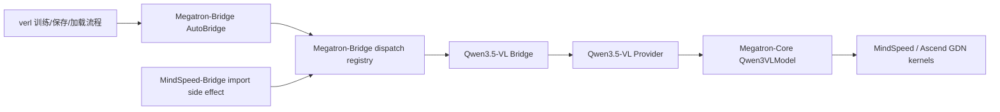
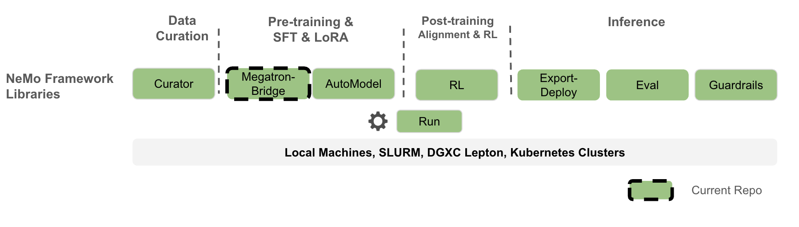
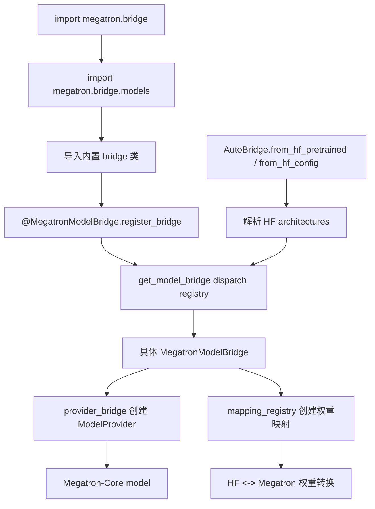
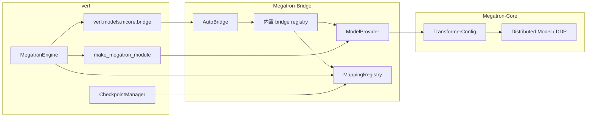
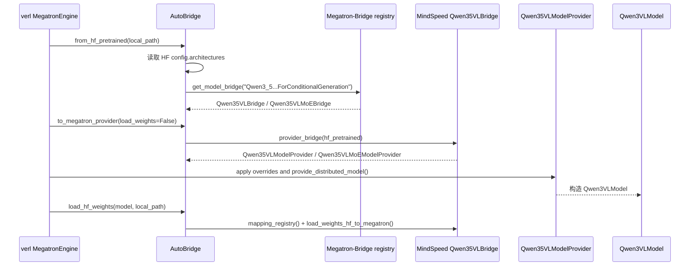
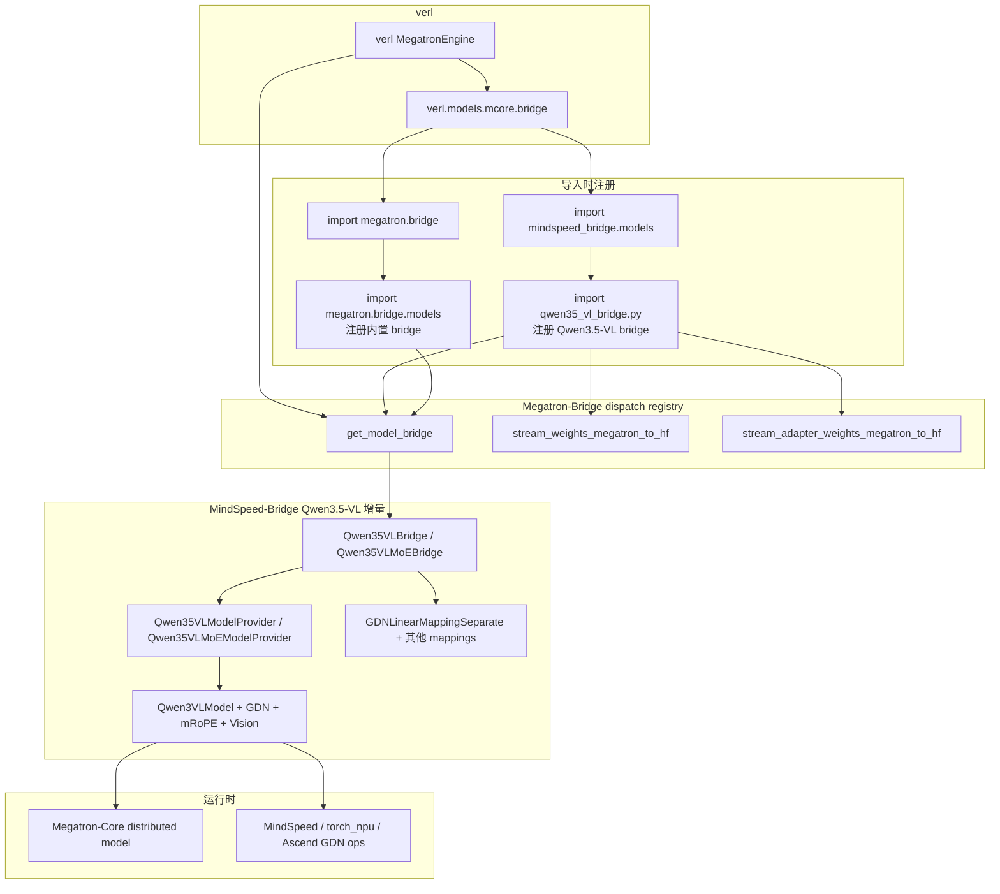
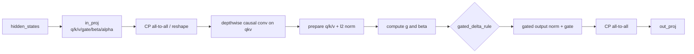

# MindSpeed-Bridge 在 verl 上的集成架构与方案设计

Last updated: 05/26/2026.

## 1. 总览：本文目标、范围与核心结论

### 1.1 文档目标

本文基于本地源码说明 `mindspeed_bridge` 如何接入 `verl` 的 Megatron-Core 训练路径。重点回答四个问题：

1. Megatron-Bridge 本身包括哪些东西，在 `verl` 里如何发挥作用。
2. MindSpeed-Bridge 里有哪些东西，为什么这些东西足够完成 Qwen3.5-VL 在 Ascend / NPU 场景的适配。
3. 为什么只在 `verl/verl/models/mcore/bridge.py` 里 `import mindspeed_bridge.models` 就能让新模型生效。
4. MindSpeed-Bridge 中 GDN 算子的几条执行路径，特别是 `gated_delta_net.py:194` 处的分发逻辑。

### 1.2 核心结论

`verl` 并不直接识别每个 Megatron 模型架构。在非 `vanilla_mbridge` 路径里，它把 HF 配置读取、Megatron provider 构造、模型实例化前的配置转换、HF <-> Megatron 权重转换，都委托给 Megatron-Bridge 的 `AutoBridge`。

Megatron-Bridge 的模型支持是“导入即注册”：具体 bridge 类在 import 时通过 `@MegatronModelBridge.register_bridge(...)` 写入全局 dispatch registry。后续 `AutoBridge` 只需要根据 HF config 中的 `architectures` 查 registry。

MindSpeed-Bridge 因此不需要重写 `verl` 的 worker、engine、checkpoint、PEFT、DDP 包装或 PPO/GRPO 逻辑。它只需要提供 Qwen3.5-VL 相关的 bridge、provider、Megatron 模型实现、权重映射和 NPU 友好的 GDN 算子路径。

`import mindspeed_bridge.models` 的作用不是让 `verl` 直接调用 MindSpeed-Bridge API，而是触发 MindSpeed-Bridge 中 Qwen3.5-VL bridge 类定义，从而把新架构注册进 Megatron-Bridge 的同一个 registry。注册完成后，`verl` 继续使用原来的 `AutoBridge` 调用链。

### 1.3 总体架构

整体可以理解为：`verl` 调用 Megatron-Bridge，MindSpeed-Bridge 通过 import side effect 扩展 Megatron-Bridge 的模型 registry。



## 2. Scope A：Megatron-Bridge 基线能力与 verl 调用链

### 2.1 Megatron-Bridge 本身包括什么

从本地 `Megatron-Bridge/src/megatron/bridge` 目录看，Megatron-Bridge 是一个覆盖面较大的库，主要包含：

| 模块 | 作用 | 本次 verl 集成是否直接依赖 |
| --- | --- | --- |
| `models/conversion` | `AutoBridge`、`MegatronModelBridge`、mapping registry、参数映射、HF <-> Megatron 权重流式转换 | 是 |
| `models/*` | 内置模型 bridge / provider / 部分模型实现，如 Llama、Qwen、Qwen-VL、DeepSeek 等 | 是，作为原生注册集合 |
| `models/hf_pretrained` | HF 配置、权重状态源和预训练模型包装 | 是 |
| `peft` | LoRA/DoRA 等 PEFT 支持和 hook | verl 使用 Megatron-Bridge provider 路径时会接入 |
| `training` | 原生训练循环、checkpoint、optimizer、tokenizer、utils | verl 不使用其完整训练循环，但使用 `training.utils.train_utils` 中的 callback 工具 |
| `data` / `recipes` / `inference` / `diffusion` | 独立数据、训练 recipe、推理和扩散模型支持 | 本次 verl 接入不是主路径 |

Megatron-Bridge 在 README 中的定位是 Hugging Face 与 Megatron-Core 之间的 bridge / conversion / verification layer，并且提供原生训练 recipe。原始架构图位于本地仓库：



### 2.2 Megatron-Bridge 的核心注册机制

Megatron-Bridge 采用三层模型桥接模式：

1. `AutoBridge`：高层入口，负责读取 HF config、识别 `architectures`，然后从 registry 中找到对应 bridge。
2. `MegatronModelBridge`：每个模型族的转换编排类，核心方法是 `provider_bridge()` 和 `mapping_registry()`。
3. `ModelProvider` / `MegatronMappingRegistry`：前者负责构造 Megatron-Core 模型，后者负责 HF <-> Megatron 参数名和张量布局转换。

关键源码依据：

- `Megatron-Bridge/src/megatron/bridge/__init__.py:16` 会先 `import megatron.bridge.models`，触发内置模型注册，再导出 `AutoBridge`。
- `Megatron-Bridge/src/megatron/bridge/models/__init__.py` 批量 import 内置模型 bridge/provider。
- `Megatron-Bridge/src/megatron/bridge/models/conversion/model_bridge.py:1785` 定义 `register_bridge()` 装饰器。
- `model_bridge.py:1958` 的 `create_bridge_decorator()` 会记录 `SOURCE_NAME`、`MODEL_TYPE`、`PROVIDER_CLASS`，并调用 `register_bridge_implementation()`。
- `model_bridge.py:1890` 的 `register_bridge_implementation()` 把 bridge 写入 `get_model_bridge`、`stream_weights_megatron_to_hf` 等 dispatch 实现。
- `auto_bridge.py:1461` 的 `_model_bridge` 属性通过 `model_bridge.get_model_bridge(self._causal_lm_architecture, hf_config=...)` 获取实际 bridge。
- `auto_bridge.py:1280` 的 `to_megatron_provider()` 调用 `self._model_bridge.provider_bridge(...)` 创建 provider，并在 `load_weights=True` 时注册 HF -> Megatron 权重加载 hook。

原生 Megatron-Bridge 的注册与分发链路：



### 2.3 Megatron-Bridge 在 verl 里的作用

`verl` 的 Megatron engine 当前要求 `use_mbridge=True`。它有两条路径：

1. `vanilla_mbridge=True`：走旧的 `mbridge` 包，入口是 `verl/verl/models/mcore/mbridge.py`。
2. `vanilla_mbridge=False`：走 Megatron-Bridge，入口是 `verl/verl/models/mcore/bridge.py`。

本方案讨论的是第二条路径。`verl` 非 `vanilla_mbridge` 的主流程如下：

1. `verl/verl/workers/engine/megatron/transformer_impl.py:190` 从 `verl.models.mcore.bridge` 导入 `AutoBridge`。
2. `transformer_impl.py:193` 用 `AutoBridge.from_hf_pretrained(self.model_config.local_path, trust_remote_code=...)` 读取 HF 模型。
3. `transformer_impl.py:197` 调用 `bridge.to_megatron_provider(load_weights=False)` 得到 Megatron-Bridge provider。
4. `transformer_impl.py:202` 到 `:228` 给 provider 注入 TP/PP/EP/CP、sequence parallel、attention backend、MoE dispatcher 等 `verl` 运行时配置，并 finalize。
5. `verl/verl/utils/megatron_utils.py:232` 之后，如果存在 provider，就通过 `provider.provide_distributed_model(...)` 构造 Megatron-Core 模型，并注册 PEFT、value model、freeze router 等 pre-wrap hooks。
6. `transformer_impl.py:298` 使用 `self.bridge.load_hf_weights(...)` 加载 HF 权重。
7. checkpoint 恢复和保存也走同一个 bridge：`megatron_checkpoint_manager.py:642` 加载 HF checkpoint，`:779` / `:834` 保存 HF 权重。

verl 原生 Megatron-Bridge 集成图：



## 3. Scope B：MindSpeed-Bridge 增量、注册接入与 import 生效机制

### 3.1 MindSpeed-Bridge 包含什么

从本地 `MindSpeed-Bridge/mindspeed_bridge` 看，当前 MindSpeed-Bridge 是一个很薄的 Megatron-Bridge 扩展包，主要内容是：

| 目录/文件 | 内容 | 集成角色 |
| --- | --- | --- |
| `models/__init__.py` | import `qwen_vl` 中的模型、provider、bridge | 触发注册入口 |
| `models/qwen_vl/qwen35_vl_bridge.py` | Qwen3.5-VL dense / MoE 的 bridge 类、HF config -> provider 转换、参数映射 | 核心注册与权重转换 |
| `models/qwen_vl/qwen35_vl_provider.py` | Qwen3.5-VL dense / MoE provider、混合 GDN+Attention layer spec、模型构造 | 核心模型构造 |
| `models/qwen_vl/modelling_qwen3_vl/*` | Qwen3-VL 风格 Megatron 模型、text/vision model、mRoPE、attention、transformer block、GDN layer 和 GDN 算子实现 | 核心运行时模型 |
| `models/conversion/param_mapping.py` | `GDNLinearMappingSeparate`，处理 Qwen3.5 的分离 GDN 投影权重 | 核心权重映射 |
| `recipes/qwen_vl/*` | Megatron-Bridge 原生训练 recipe | 对 verl 非必需 |
| `examples/*` | 转换验证和训练脚本示例 | 对 verl 非必需 |

MindSpeed-Bridge README 也说明它是在 Megatron-Bridge 基础上面向昇腾平台提供更多模型支持、精度验证和硬件亲和性能优化；当前本地仓库的“最新消息”说明创建于 2026-05，并提供 Qwen3.5-VL 支持。

### 3.2 为什么只需要这些东西

verl 接入 Megatron-Bridge 时真正需要的是四类能力：

1. `AutoBridge` 能识别 HF `architectures` 并找到 bridge。
2. bridge 能把 HF config 转为 Megatron provider。
3. provider 能构造 Megatron-Core 兼容模型。
4. bridge 能把 HF 权重映射到 Megatron 模型，并支持导出回 HF。

MindSpeed-Bridge 因此只需要补齐 Qwen3.5-VL 的模型差异：

- HF class name 注册：`Qwen3_5ForConditionalGeneration` 和 `Qwen3_5MoeForConditionalGeneration`。
- Qwen3.5-VL provider：混合 GDN + 标准 attention、mRoPE、vision encoder、MoE / dense MLP、MTP 等配置。
- Qwen3.5-VL 模型实现：`Qwen3VLModel`、`Qwen3VLGPTModel`、vision model、transformer block、attention、rope。
- GDN 算子：Triton、Ascend C / NPU、自带 torch fallback 三条路径。
- 参数映射：标准 attention QKV、GDN conv / in_proj / out_norm、dense MLP 或 MoE expert、vision 模块权重、MTP 权重等。

它不需要重写：

- verl 的 PPO / GRPO / worker / engine 调度。
- Megatron-Core 的 DDP、TP、PP、EP、CP 基础设施。
- Megatron-Bridge 的 `AutoBridge`、registry、streaming conversion、PEFT hook 框架。
- verl checkpoint manager 和模型 forward 包装。

换句话说，MindSpeed-Bridge 是“模型支持插件”，不是新的训练框架。

### 3.3 MindSpeed-Bridge 与 register_bridge 机制

`MindSpeed-Bridge/mindspeed_bridge/models/qwen_vl/qwen35_vl_bridge.py` 中有两个关键注册：

```python
@MegatronModelBridge.register_bridge(
    source="Qwen3_5MoeForConditionalGeneration",
    target=Qwen3VLModel,
    provider=Qwen35VLMoEModelProvider,
    model_type="qwen3_5_moe",
)
class Qwen35VLMoEBridge(Qwen3VLMoEBridge):
    ...
```

```python
@MegatronModelBridge.register_bridge(
    source="Qwen3_5ForConditionalGeneration",
    target=Qwen3VLModel,
    provider=Qwen35VLModelProvider,
    model_type="qwen3_5",
)
class Qwen35VLBridge(MegatronModelBridge):
    ...
```

这里的 `source` 使用字符串是合理的：Megatron-Bridge 的 `AutoBridge` 支持用 HF architecture class 对象或 class name string 做 registry key；当模型通过 `auto_map` 或当前 `transformers` 版本无法直接取到 class 对象时，会退回字符串 key。

注册后的运行链路是：



### 3.4 为什么在 bridge.py 里 import mindspeed_bridge 就能生效

`verl/verl/models/mcore/bridge.py` 当前核心代码是：

```python
from megatron.bridge import AutoBridge
import mindspeed_bridge.models
from megatron.bridge.training.utils.train_utils import LinearForLastLayer, freeze_moe_router, make_value_model
```

这三行产生两个 side effect：

1. `from megatron.bridge import AutoBridge` 会执行 `megatron.bridge.__init__`，其中 `import megatron.bridge.models` 会注册 Megatron-Bridge 内置模型。
2. `import mindspeed_bridge.models` 会执行 `mindspeed_bridge/models/__init__.py`，继续导入 `mindspeed_bridge.models.qwen_vl`，再导入 `qwen35_vl_bridge.py`。bridge 类定义时装饰器立即运行，把 Qwen3.5-VL dense / MoE 注册到 Megatron-Bridge 的同一个 dispatch registry。

因此后续 `verl` 调用的仍然是 Megatron-Bridge 原来的 `AutoBridge` 对象，只是 registry 中多了 MindSpeed-Bridge 的条目。`verl` 不需要直接 import `Qwen35VLBridge`，也不需要在 engine 中写 Qwen3.5-VL 分支。

新的集成架构图：



生效前提：

- `vanilla_mbridge=False`，否则 `verl` 会走 `verl.models.mcore.mbridge` 的旧 `mbridge` 包。
- `mindspeed_bridge` 在运行时 `PYTHONPATH` / site-packages 中可 import。
- HF config 的 `architectures` 能解析到 `Qwen3_5ForConditionalGeneration` 或 `Qwen3_5MoeForConditionalGeneration`。
- `transformers` 版本满足 Qwen3.5 配置类要求；本地 MindSpeed-Bridge requirements 使用 `transformers==5.3.0`，MoE provider 内部要求 `>=5.2.0`。
- GDN 路径所需的 `mindspeed`、`torch_npu` / `torch.ops.npu` 自定义算子和相关 kernel 已安装并匹配运行环境。

## 4. Scope C：Qwen3.5-VL 模型适配、GDN 算子与落地建议

### 4.1 Qwen3.5-VL provider 与模型构造

MindSpeed-Bridge 的 Qwen3.5-VL provider 做了两件事：

1. 从 HF config 转换为 Megatron provider 属性。
2. 构造 hybrid block spec，并创建 `Qwen3VLModel`。

MoE bridge 的 `provider_bridge()` 主要设置：

- Qwen3 基础属性：RMSNorm、GLU、QK layernorm、无 linear bias。
- Hybrid attention：`experimental_attention_variant="gated_delta_net"`，`linear_attention_freq` 表示每隔若干层插入标准 attention。
- GDN 参数：`linear_conv_kernel_dim`、`linear_key_head_dim`、`linear_value_head_dim`、`linear_num_key_heads`、`linear_num_value_heads`。
- MoE 参数：expert 数、top-k、shared expert、all-to-all dispatcher、grouped GEMM 等。
- VLM 参数：`position_embedding_type="mrope"`、vision config、image/video token id、mRoPE section。

`qwen35_vl_provider.py` 中的 `get_qwen35_block_spec()` 会按层构造异构 `TransformerBlockSubmodules`：

- GDN 层使用 `GatedDeltaNet`。
- 标准 attention 层使用 Megatron-Core self attention，然后通过 `_patch_standard_attention_specs()` 只替换标准 attention 为 `Qwen3VLSelfAttention`，保留 GDN 层不变。
- MLP 侧按是否 MoE 选择 dense MLP 或 MoE spec。
- 按 PP / VPP 当前 stage 切分 layer specs。

这部分是 MindSpeed-Bridge 必须提供的原因：Qwen3.5-VL 不是纯 GPT decoder，也不是所有层同构 attention；如果只依赖 Megatron-Bridge 通用 GPT provider，无法表达“3 个 GDN 层 + 1 个标准 attention 层”的混合结构，也无法正确处理 VLM 的 mRoPE 和 vision encoder。

### 4.2 参数映射设计

Qwen3.5-VL 的 bridge 通过 `mapping_registry()` 返回 Megatron-Bridge 的 `MegatronMappingRegistry`。关键映射包括：

- 语言模型 embedding、output layer、final norm。
- 标准 attention 的 QKV fusion：`QKVMapping` 把 HF 的 `q_proj/k_proj/v_proj` 合并为 Megatron 的 `linear_qkv.weight`。
- GDN 参数：
  - `GDNConv1dMapping` 处理 depthwise causal conv。
  - `GDNLinearMappingSeparate` 处理 Qwen3.5 HF 侧分离的 `in_proj_qkv/in_proj_z/in_proj_b/in_proj_a` 到 Megatron 单个 `in_proj.weight`。
  - `RMSNorm2ZeroCenteredRMSNormMapping` 处理 GDN output norm 的 zero-centered RMSNorm 转换。
- MoE 参数：
  - router。
  - routed expert gate/up/down。
  - shared expert 和 shared expert gate。
- vision 模块参数：
  - vision attention QKV。
  - vision MLP。
  - patch embedding、pos embedding、merger。
- MTP 参数：如果 HF config 中有 `mtp_num_hidden_layers`，额外注册 MTP 层映射。

`GDNLinearMappingSeparate` 是 MindSpeed-Bridge 的关键新增映射。它的作用是把 HF 的四个独立投影张量先重组成 Megatron-Bridge 既有工具期望的 grouped `qkvz` / `ba` 中间格式，再复用 `merge_gdn_linear_weights()` / `split_gdn_linear_weights()` 的 TP 分片逻辑。这样避免重写 Megatron-Bridge 的 GDN TP 处理。

### 4.3 GDN 算子路径

核心选择逻辑在 `MindSpeed-Bridge/mindspeed_bridge/models/qwen_vl/modelling_qwen3_vl/gated_delta_net.py:194`：

```python
if HAVE_FLA and self.use_triton_gdn:
    self.gated_delta_rule = chunk_gated_delta_rule
elif self.use_ascend_gdn:
    self.gated_delta_rule = flash_gated_delta_rule
else:
    self.gated_delta_rule = torch_chunk_gated_delta_rule
```

这三条路径共享同一个 GDN layer 前后处理：



具体路径如下：

| 路径 | 触发条件 | 执行函数 | 主要特点 |
| --- | --- | --- | --- |
| Triton / MindSpeed kernel | `HAVE_FLA=True` 且 `config.use_triton_gdn=True` | `chunk_gated_delta_rule` | 主要使用 `mindspeed.ops.triton.*` kernel，包括 `chunk_local_cumsum`、`chunk_scaled_dot_kkt_fwd`、`solve_tril`、`chunk_fwd_o` 等 |
| Ascend C / NPU flash | 未命中 Triton 路径，且 `config.use_ascend_gdn=True` | `flash_gated_delta_rule` | 前半段使用 MindSpeed Triton 辅助算子，核心 forward/backward 通过 `torch.ops.npu.*` Ascend C 算子执行 |
| Torch fallback | 不启用 Triton GDN，且不启用 Ascend GDN | `torch_chunk_gated_delta_rule` | deterministic / fallback 路径；当前不支持 `cu_seqlens`；性能预期低于专用 kernel |

Ascend C / NPU flash 路径是 Ascend 集成最核心的性能路径。它在 `flash_gated_delta_rule.py` 中会把数据从 `[B, H, T, D]` 转为 Ascend C 算子需要的 `[T, B, H, D]`，forward 调用 `torch.ops.npu.npu_recompute_w_u_fwd`、`torch.ops.npu.npu_chunk_gated_delta_rule_fwd_h`、`torch.ops.npu.npu_chunk_fwd_o`，backward 调用 `torch.ops.npu.npu_chunk_bwd_dv_local`、`torch.ops.npu.npu_chunk_gated_delta_rule_bwd_dhu`、`torch.ops.npu.npu_chunk_bwd_dqkwg`、`torch.ops.npu.npu_prepare_wy_repr_bwd_da`、`torch.ops.npu.npu_prepare_wy_repr_bwd_full`。

GDN layer 在进入 `gated_delta_rule` 前还会对 q/k/v 做 depthwise causal conv。如果 `causal_conv1d` 不存在，或 `config.deterministic_mode=True`，使用 `torch.nn.functional.conv1d`；否则使用 `causal_conv1d` 包的 optimized path。这不是第 194 行的三选一逻辑，但会影响 GDN 的整体性能和 packed sequence 行为。

### 4.4 verl 集成建议与风险

推荐落地方式：

1. 保持 `verl/verl/models/mcore/bridge.py` 中的 `import mindspeed_bridge.models`，让 MindSpeed-Bridge 通过注册 side effect 接入 Megatron-Bridge。
2. 运行 Qwen3.5-VL / MindSpeed-Bridge 时使用 `use_mbridge=True`、`vanilla_mbridge=False`。
3. 在 `verl` 的 Megatron engine provider override 中确保 GDN 路径开关进入最终 config，例如 Ascend 场景启用 `use_ascend_gdn=True`，并明确关闭或不启用 `use_triton_gdn`，避免优先命中 Triton 路径。
4. 确认运行环境包含 MindSpeed-Bridge、MindSpeed、torch_npu / NPU 自定义算子、匹配的 `transformers` 版本。
5. 首次联调建议先验证 registry：`AutoBridge.list_supported_models()` 应包含 `Qwen3_5ForConditionalGeneration` 和 `Qwen3_5MoeForConditionalGeneration`；对目标 HF 目录调用 `AutoBridge.from_hf_pretrained(...).to_megatron_provider(load_weights=False)` 应返回 MindSpeed provider。
6. 权重加载失败时优先检查 `mapping_registry()` 中 HF 参数名是否与实际 checkpoint 对齐，尤其是 GDN 的 `in_proj_qkv/in_proj_z/in_proj_b/in_proj_a` 和 MoE expert 命名。

需要关注的风险：

1. `bridge.py` 当前对 `mindspeed_bridge.models` 的 `ModuleNotFoundError` 会直接 re-raise，因此非 Ascend / 非 MindSpeed 环境也会因为缺少 MindSpeed-Bridge 而无法使用 Megatron-Bridge 路径。如果希望保持通用性，应考虑把该 import 做成可选能力，或只在 Ascend/Qwen3.5-VL 配置下启用。
2. `GatedDeltaNet` 直接读取 `config.use_triton_gdn` 和 `config.use_ascend_gdn`。需要确认 `verl` provider override 后，这两个属性一定存在；否则会在构造 GDN layer 时失败。
3. Ascend flash 路径依赖 `torch.ops.npu.*` 自定义算子。源码只在 import 时尝试 `import fla_npu`，但实际执行时若 NPU op 未注册，会在运行期失败。
4. `torch_chunk_gated_delta_rule` 不支持 `cu_seqlens`，不能作为 packed variable-length 训练的完整性能路径。
5. 当前文档结论基于本地源码静态阅读，未运行训练、推理或单元测试；本地 workspace 说明也不建议在未明确要求时运行 ML runtime。

